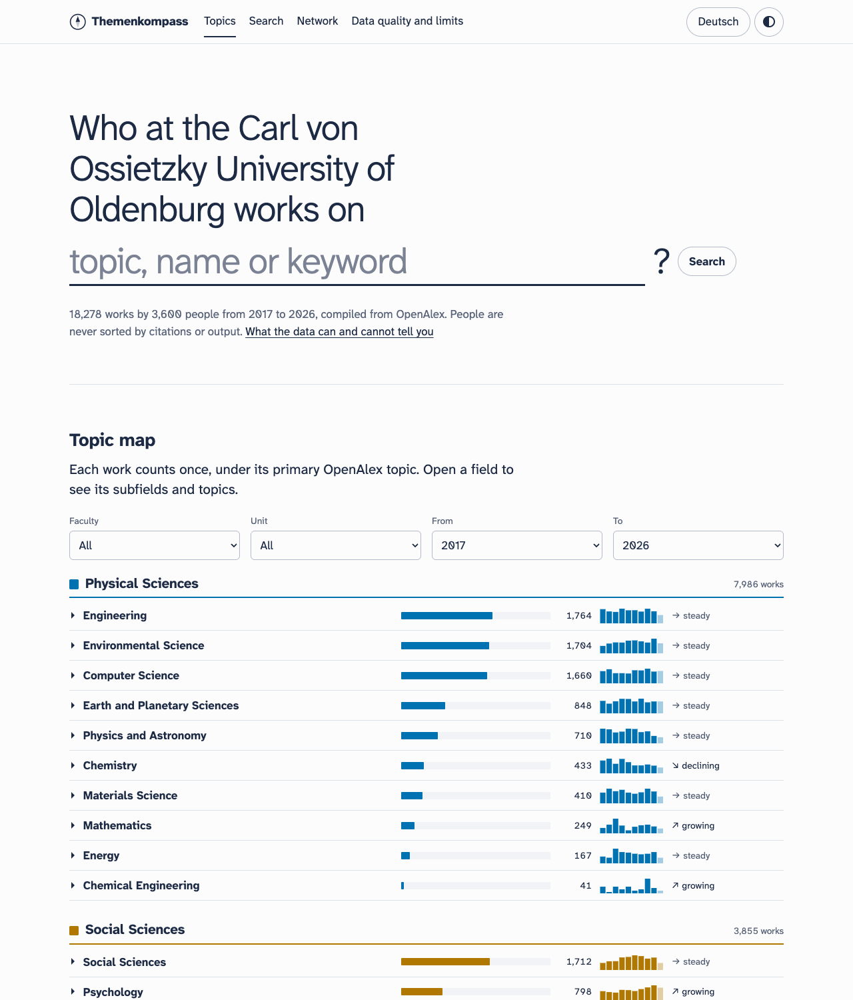

# Themenkompass

**Who at a university researches which topic, how actively, and with whom?**

Themenkompass turns open bibliographic data from [OpenAlex](https://openalex.org) into a
searchable map of a university's research: topics, people, recent works and co-author
networks. It is built for students looking for a thesis topic, a seminar or a student
assistant position, and it runs for free as a static site. The first instance covers the
Carl von Ossietzky University of Oldenburg; any other university can be added with one
configuration file.

People are never ranked. There are no citation counts, no scores and no contact details.



**Live:** https://themenkompass.pages.dev *(link active after the first deployment)*

## Key findings (Oldenburg, 2017–2026, data as of 29 September 2026)

1. **Research here is collaborative.** 74 % of the 18,278 works have at least one
   co-author from outside the university (including local hospitals and research
   institutes), and 43 % have a co-author abroad, most often in the US, the UK and the
   Netherlands.
2. **OpenAlex alone cannot tell you who belongs to which department.** 73 % of the
   university's authorships name a recognisable unit in their affiliation text. For
   377 of 3,600 listed people (10 %) not even the faculty can be recognised. This gap is
   why the project uses a curated mapping file that anyone can improve by pull request.
3. **What is shown is reliable; what is missing is mostly out of scope.** In a random
   sample of 20 people, 94 of the 96 works on their ORCID records that fall within the
   site's scope were found (2023–2025), with no misattributed works. But 44 of 141 ORCID
   works do not link the person to the university in OpenAlex, so work done under other
   affiliations is not shown. [Details](#limits)

## What it does

| Feature | |
|---|---|
| Topic map | OpenAlex hierarchy (domain › field › subfield › topic), works per year, trend; filter by faculty, unit and period |
| Search | Full text over topics, people, titles and journals, entirely in the browser (MiniSearch), typo-tolerant |
| Person pages | Units with the evidence behind the assignment, topics, works of the last five years, frequent co-authors, partner institutions, activity in plain words |
| Co-author network | Within the university and to external institutions; filter by faculty, unit, field, subfield and period; table view for screen readers |
| Data quality page | How assignments are made, known errors, what is not covered, validation results, how to report errors or request removal |

German and English, light and dark theme, colour-blind-safe palette (Okabe–Ito),
keyboard and screen-reader friendly, usable on a phone.

## Architecture

```
            monthly GitHub Action (cron + manual)                      static hosting
┌────────────────────────────────────────────────────────┐   ┌────────────────────────────┐
│ config/<slug>.toml ──► fetch ──► model ──► export      │   │ Cloudflare Pages           │
│ mappings/<slug>.csv      │         │         │         │   │  web/ (Vite + TypeScript)  │
│                    OpenAlex API    │   data/<slug>/*.parquet  │  MiniSearch, Plot,       │
│                (cursor paging,     │   web/public/data/*.json ─►  Cytoscape              │
│                 retries, cache,  polars                │   │  no server, no database    │
│                 budget guard)                          │   └────────────────────────────┘
└────────────────────────────────────────────────────────┘
```

- **Pipeline** (`src/themenkompass`, Python 3.12, uv, httpx, polars): fetches all works
  of the institution and its OpenAlex sub-institutions with cursor paging, retries
  with backoff, an on-disk cache and a budget guard that stops before OpenAlex's free
  daily allowance could be exceeded. People are identified only by OpenAlex author ids;
  merged ids in curated files are followed automatically.
- **Units** are recognised from the raw affiliation text on each work (regular
  expressions per unit in the config), from OpenAlex sub-institutions, and from the
  optional mapping file `mappings/<slug>.csv`. No university web pages are scraped.
- **Output**: Parquet tables for analysis (`data/<slug>/`) and compact JSON for the site
  (`web/public/data/<slug>/`), about 11 MB in total. Exports are deterministic, so the
  monthly commit only changes what really changed.
- **Quality**: pytest, ruff, mypy (strict), vitest and a TypeScript type check run in CI
  on every push. A fictional test dataset lets CI run without any API access. A
  consistency check verifies the committed data (references, removed people, size).

## Run it locally

```bash
uv sync
uv run themenkompass --config config/uol.toml run      # fetch (about $0.02 of the free allowance) + build
uv run pytest
cd web && npm ci && npm run dev
```

Set `OPENALEX_API_KEY` (free at openalex.org) for the larger allowance; without a key the
pipeline still works within the $0.10/day keyless budget.

## Add another university

```bash
uv run themenkompass find-institution "University of Example" --slug example
```

prints the ROR id, the OpenAlex id, its sub-institutions and a config skeleton. Then list
the affiliation strings that still need a unit and add patterns until coverage is good:

```bash
uv run themenkompass --config config/example.toml fetch
uv run themenkompass --config config/example.toml affiliations --unmatched
```

See [CONTRIBUTING.md](CONTRIBUTING.md) for the mapping file and the review rules.

## Data sources

OpenAlex (works, authors, topics, institutions; CC0), ROR (institution ids; CC0) and, for
validation only, public ORCID records. Terms, limits and retrieval dates are in
[DATA_SOURCES.md](DATA_SOURCES.md).

## Limits

- OpenAlex has no faculties, departments or chairs. Assignments come from affiliation
  text and can be wrong or missing; 10 % of listed people have no faculty.
- Works that do not name the university, or where OpenAlex does not recognise it, are
  missing. Book chapters, German-language publications, law and the humanities are
  covered less well than journal articles in the sciences.
- OpenAlex identifies people algorithmically: one person can have two profiles, two
  people can share one.
- Topics are assigned automatically by OpenAlex and are in English.
- Not covered: chairs (unless curated), job openings, thesis topics, teaching, grants.
- Validation (20 people, 2023–2025, against their ORCID records): 94 of 96 in-scope works
  found; 125 works shown that are not on ORCID, none clearly misattributed, at least six
  duplicate versions. ORCID is partly filled from Crossref, the same source OpenAlex uses,
  so gaps for works without DOI are likely underestimated.

The site's page “Data quality and limits” explains all of this for non-specialists.

## Personal data

Themenkompass shows names and publications of researchers, i.e. personal data under the
GDPR. The approach:

- **Only public, professional, bibliographic information**: name, works, topics,
  co-authorships, ORCID and OpenAlex ids. No contact details, photos, citation counts,
  rankings or anything else about the person.
- **Legal basis: legitimate interest** (Art. 6(1)(f) GDPR). The purpose is orientation
  for students; the data is already public and limited to publishing activity. People
  with fewer than two works in ten years get no page.
- **Information** (Art. 14 GDPR): the site's privacy notice says where the data comes
  from, why it is shown and which rights people have.
- **Rectification**: an issue form for errors; corrections go into the mapping file and
  apply with the next update. Answer within 14 days.
- **Erasure and objection**: anyone can ask to be removed, without giving a reason, via
  an issue form or privately via the contact in the legal notice. Removed OpenAlex ids go
  to `mappings/<slug>.exclude.csv`; they are dropped from the site, from works where they
  are the only listed person, and from all future updates. CI fails if an excluded id
  ever appears in the data.
- **No tracking**: no cookies, no analytics, no third-party requests; the font is
  self-hosted.

## Cost

Everything runs on free tiers: GitHub Actions (public repository), Cloudflare Pages and
OpenAlex's free daily allowance. A monthly update uses about 200 OpenAlex list requests
($0.02 of the free $1/day). The pipeline refuses priced features (full-text search,
content downloads) and stops before the free allowance is used up.

## License and citation

Code: MIT ([LICENSE](LICENSE)). Data: derived from OpenAlex, CC0. If you use the project,
please cite it via [CITATION.cff](CITATION.cff).
